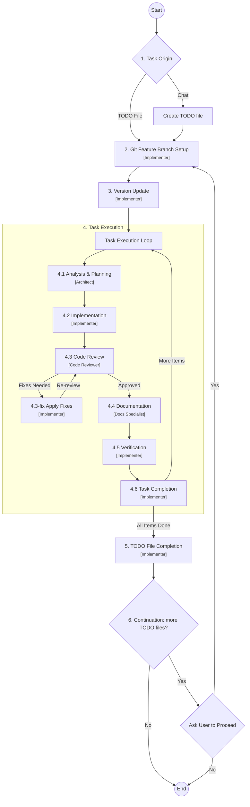

# Base Project for AI Agent Driven Development

This project serves as a foundational template for future AI-agent driven development. It is pre-configured with essential rules, workflows, and structures optimized for collaboration between human developers and AI agents (specifically Kilo Code).

**Attention AI Agents:** Before making any changes, you **must** read and adhere to the guidelines outlined in [`AGENTS.md`](AGENTS.md). This file contains critical information about the project's workflow, rules, and architectural standards.

## Compatibility

This template was implemented and tested with the **Kilo Code VSCode plugin**. It should also work with:

- **Kilo Code CLI** (command-line interface)
- Any AI agent manager or similar tool that supports custom sub-agent definitions, rule files, and workflow commands via markdown-based configuration

The project uses standard Markdown-based configuration (`.kilo/`, `.agent/`) and does not depend on any proprietary format, making it adaptable to other AI-driven development tools.

## Prerequisites

- **Kilo Code**: Optimized for the Kilo Code plugin for VSCode, with CLI support. See [compatibility section](#compatibility) for details.
- **Git**: Ensure your environment is configured for the workflow. See [`how-to-set-up-git.md`](docs/how-to-set-up-git.md).

## About this Project

The primary goal of this repository is to provide a clean, structured starting point for new projects with built-in "AI-Readiness."

### Design Principles

- **Foundation**: A structured baseline for new repositories.
- **AI-Readiness**: Integrated configurations (like `.kilo`, `.agent`, and `.kilocodeignore`) to enable immediate and effective AI agent participation.
- **Standardization**: Established coding standards, workflows, and documentation practices.
- **Project Info**: A persistent context and knowledge management system for agents.

## Project Structure

Understanding the purpose of the configuration directories is key to effective development:

- [`.agent/`](.agent/): Stores project-specific agent context. Includes [`.agent/project-info/`](.agent/project-info/) for persistent project knowledge (`brief.md`, `product.md`, `context.md`, `architecture.md`, `tech.md`), the [`.agent/todos/`](.agent/todos/) directory for task tracking, local rules, and the [`project-structure.md`](.agent/project-structure.md) map.
- [`.kilo/`](.kilo/): The operational core of the AI integration. Contains custom [`.kilo/agents/`](.kilo/agents/) (Architect, Implementer, Code Reviewer, Docs Specialist, etc.), global [`.kilo/rules/`](.kilo/rules/) (19 rule files), standardized [`.kilo/commands/`](.kilo/commands/) (workflows like the Critical Workflow), [`.kilo/modes/`](.kilo/modes/) for agent mode overrides, and the [`.kilo/plans/`](.kilo/plans/) directory where agents store detailed implementation plans.
- [`.kilocodeignore`](.kilocodeignore): Controls which files are excluded from codebase indexing, skipping lock files, dependency directories, build outputs, and binary assets.

## The Critical Workflow

The project follows a standardized process for task execution, ensuring systematic progress from analysis to deployment. Each step is handled by a dedicated sub-agent:



For full details, see [`critical-workflow.md`](.kilo/commands/critical-workflow.md).

## How to Start a Task

To initiate work with an AI agent, use one of the following copy-paste friendly commands in the chat.

> **Note on Project Info:** When cloning this template for a new project, the Project Info initialization workflow will trigger automatically. The file `.agent/project-info/brief.md` defines the project's core requirements and scope — AI agents rely on this for context across sessions. To initialize, run `/critical-workflow` and ask to "initialize project info". See [`.kilo/commands/project-info-init.md`](.kilo/commands/project-info-init.md) for details. If the project brief is not defined, agents may produce work that does not align with your goals.

### Option 1: Using a TODO File (Recommended)

1. Create a new file named `YYYYMMDD-todo-X.md` in `.agent/todos/`.
2. Paste the following into the chat:

```text
full read @AGENTS.md & follow /critical-workflow
do @/.agent/todos/<YYYYMMDD>/<YYYYMMDD>-todo-<number>.md
```

### Option 2: Direct Chat Request

If you have a quick request, use this template:

```text
full read @AGENTS.md & follow /critical-workflow
do [Your specific task or request here]
```

## AI Agent Plans

The critical workflow requires the AI to generate detailed implementation plans for each task. The [Architect sub-agent](.kilo/agents/architect.md) handles analysis and planning (step 4.1), while the [Implementer sub-agent](.kilo/agents/implementer.md) executes the plan (step 4.2). A [Code Reviewer](.kilo/agents/code-reviewer.md) validates quality, and a [Docs Specialist](.kilo/agents/docs-specialist.md) maintains documentation.

The AI agent will ask for your approval before proceeding with plans. To skip approval prompts, include in the TODO file or chat request:

```text
"Don't request me to approve plans"
```

---

*Note: This workflow is actively maintained and updated to improve stability and introduce new features.*
