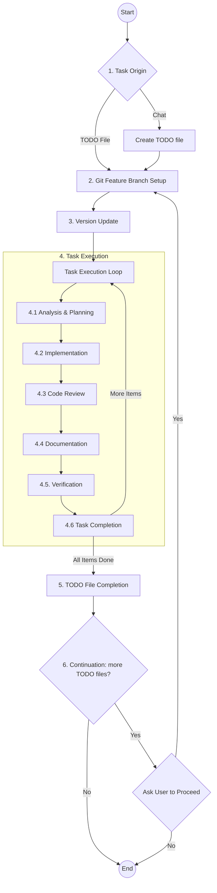

# Base Project for AI Agent Driven Development

This project serves as a foundational template for future AI-agent driven development. It is pre-configured with essential rules, workflows, and structures optimized for collaboration between human developers and AI agents (specifically Kilo Code).

**Attention AI Agents:** Before making any changes, you **must** read and adhere to the guidelines outlined in [`AGENTS.md`](AGENTS.md). This file contains critical information about the project's workflow, rules, and architectural standards.

## About this Project

The primary goal of this repository is to provide a clean, structured starting point for new projects with built-in "AI-Readiness."

### Core Requirements

- **Foundation**: A structured baseline for new repositories.
- **AI-Readiness**: Integrated configurations to enable immediate and effective AI agent participation.
- **Standardization**: Established coding standards, workflows, and documentation practices.
- **Project Info**: A persistent context and knowledge management system for agents.

## Project Structure

Understanding the purpose of the configuration directories is key to effective development:

- [`.agent/`](.agent/): Stores project-specific agent context. Includes the [`.agent/todos/`](.agent/todos/) directory for task tracking, local rules, and the [`project-structure.md`](.agent/project-structure.md) map.
- [`.kilo/`](.kilo/): The operational core of the AI integration. Contains global [`.kilo/rules/`](.kilo/rules/), standardized [`.kilo/commands/`](.kilo/commands/) (workflows), and the [`.kilo/plans/`](.kilo/plans/) directory where agents store detailed implementation plans.

## The Critical Workflow

The project follows a standardized process for task execution, ensuring systematic progress from analysis to deployment.



For full details, see [`critical-workflow.md`](.kilo/commands/critical-workflow.md).

## How to Start a Task

To initiate work with an AI agent, use one of the following copy-paste friendly commands in the chat.

### Option 1: Using a TODO File (Recommended)

1. Create a new file named `YYYYMMDD-todo-X.md` in `.agent/todos/`.
2. Paste the following into the chat:

```text
follow /critical-workflow and full read @/AGENTS.md
do: @/.agent/todos/<YYYYMMDD>/<YYYYMMDD}-todo-<number>.md
```

### Option 2: Direct Chat Request

If you have a quick request, use this template:

```text
follow /critical-workflow and full read @/AGENTS.md
do: [Your specific task or request here]
```

## Prerequisites

- **Kilo Code**: Optimized for the Kilo Code plugin for VSCode.
- **Git**: Ensure your environment is configured for the workflow. See [`how-to-set-up-git.md`](docs/how-to-set-up-git.md).

## AI Agent Plans

The critical workflow forces the AI to generate plan files to solve the requested tasks. This plan files will be later used in the process as a guide for the same or another agent types.
The AI agent should ask for your approval to the plans before continue.
If you want to prevent this, then include in the TODO file or in the chat's request next phrase:

```text
"Don't request me to approve plans"
```

---

*Note: This workflow is actively maintained and updated to improve stability and introduce new features.*
